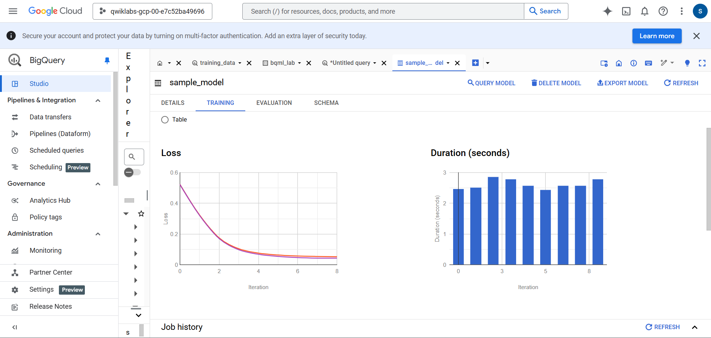
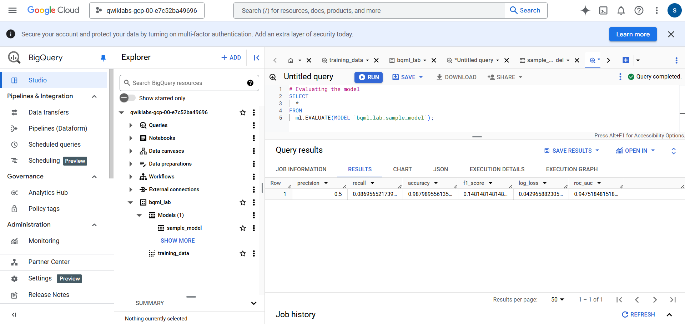
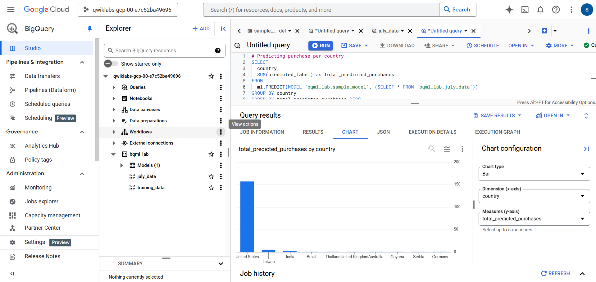

# 🛒 Predicting Visitor Purchases with BigQuery ML

## 🌟 Overview
This project demonstrates how to use **BigQuery ML** to predict visitor purchases based on the **Google Merchandise Store dataset**. The lab leverages **SQL** to create, train, and evaluate a logistic regression model, making machine learning more accessible through BigQuery's integrated capabilities.

## 🎯 Objectives
- ✅ Create a dataset in BigQuery for model training.
- ✅ Train a logistic regression model using BigQuery ML.
- ✅ Evaluate the model's performance.
- ✅ Predict visitor transactions based on the trained model.

## 📊 Dataset
The dataset used in this lab is **`bigquery-public-data.google_analytics_sample.ga_sessions_*`**. This dataset contains Google Analytics 360 data from the Google Merchandise Store, which includes features such as:

- `operatingSystem`
- `isMobile`
- `country`
- `pageviews`

The data spans a predefined time range and is used to build and evaluate the model.

## 🛠️ Tools Used
- **BigQuery Console**
- **SQL**
- **Google Cloud Platform (GCP)**

---

## 🚀 Steps

### 1️⃣ Dataset Creation
Run the following command in the CLI to create the dataset:
```bash
bq --location=US mk --dataset [PROJECT_ID]:bqml_lab
```
Verify the dataset creation:
```bash
bq ls --project_id=[PROJECT_ID]
```

### 2️⃣ Data Exploration
- Use the SQL script: [`/sql_scripts/explore_data.sql`](sql_scripts/explore_data.sql).
- Load data from the public dataset `bigquery_public-data` into the created dataset `bqml_lab`.

### 3️⃣ Model Creation
- Use the SQL script: [`/sql_scripts/create_model.sql`](sql_scripts/create_model.sql).
- Train a logistic regression model to predict if `totalTransactions > 0`.

### 4️⃣ Model Evaluation
- Use the SQL script: [`/sql_scripts/evaluate_model.sql`](sql_scripts/evaluate_model.sql).
- Evaluate the model's performance using key metrics:
  - **Log Loss**: `0.042`
  - **ROC AUC**: `0.95`

### 5️⃣ Predictions
#### Extract July 2017 Data
This query selects features similar to the training data, adding `fullVisitorId` for predictions at the user level:
```sql
#standardSQL
SELECT
  IF(totals.transactions IS NULL, 0, 1) AS label,
  IFNULL(device.operatingSystem, "") AS os,
  device.isMobile AS is_mobile,
  IFNULL(geoNetwork.country, "") AS country,
  IFNULL(totals.pageviews, 0) AS pageviews,
  fullVisitorId
FROM
  `bigquery-public-data.google_analytics_sample.ga_sessions_*`
WHERE
  _TABLE_SUFFIX BETWEEN '20170701' AND '20170801';
```
Save the query as a view:
- **Dataset**: `bqml_lab`
- **Table Name**: `july_data`

#### Predict Total Purchases Per Country
Use the trained logistic regression model to predict total purchases per country:
```sql
#standardSQL
SELECT
  country,
  SUM(predicted_label) AS total_predicted_purchases
FROM
  ML.PREDICT(MODEL `bqml_lab.sample_model`, (
    SELECT * FROM `bqml_lab.july_data`
  ))
GROUP BY
  country
ORDER BY
  total_predicted_purchases DESC
LIMIT 10;
```

#### Predict Purchases Per User
Predict the number of transactions for each visitor:
```sql
#standardSQL
SELECT
  fullVisitorId,
  SUM(predicted_label) AS total_predicted_purchases
FROM
  ML.PREDICT(MODEL `bqml_lab.sample_model`, (
    SELECT * FROM `bqml_lab.july_data`
  ))
GROUP BY fullVisitorId
ORDER BY total_predicted_purchases DESC
LIMIT 10;
```

---

## 📸 Screenshots

### Model Training Screenshot


### Model Evaluation Screenshot


### Predictions Output


---

## 📈 Results

### Key Metrics
| Metric          | Value   |
|-----------------|---------|
| Log Loss        | 0.042   |
| ROC AUC         | 0.94    |
| Precision       | 0.5     |
| Recall          | 0.086   |
| Accuracy        | 0.98    |

### Key Insights
- The model effectively identified visitor purchase behavior with an **ROC AUC** of 0.94.
- Features such as `country` and `pageviews` were strong predictors.

---

## 🔄 How to Reproduce
1. Set up a Google Cloud project and enable BigQuery.
2. Clone this repository and navigate to the `/sql_scripts` directory.
3. Run each SQL script in the BigQuery Console in order:
   - `explore_data.sql`
   - `create_model.sql`
   - `evaluate_model.sql`
4. Analyze the results in the BigQuery Console.

---

## 🧠 Key Learnings
- Built and trained a **logistic regression model** using **BigQuery ML**.
- Explored the power of SQL for both data exploration and machine learning tasks.
- Evaluated and interpreted model performance metrics directly in BigQuery.

---

## 📞 Contact
Feel free to connect with me for any queries or collaborations:
- **GitHub**: [ayushgharat234](https://github.com/ayushgharat234)
- **LinkedIn**: [Ayush Gharat](https://www.linkedin.com/in/ayush-gharat-3500a51a9/)

---

This project was part of a hands-on lab to explore **ML in BigQuery** and demonstrate how machine learning can be simplified for predictive analytics. 🚀